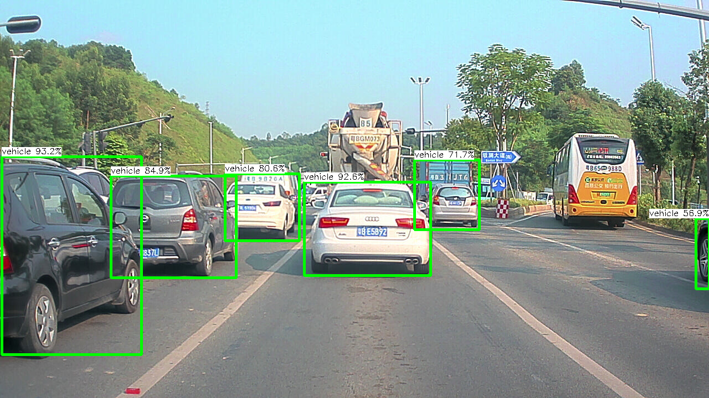

# Speed-up-network-inference-using-Ncnn
This packpage include some network inference speeding up examples using [NCNN](https://github.com/Tencent/ncnn).

## Requirement
```
Ncnn VS2017 CPU(64bit)
```

## Road object detection
Including a tiny model (about 50MFLOPs) to detect the vehicle and person.

## How to use
Firstly, convert the onnx model to ncnn model, using following script:
```
onnx2ncnn ./model/detection_model.onnx ./model/my_obj_det.param ./model/my_obj_det.bin
```
Then, check the test pictures dir, model dir in my_obj_det.cpp (line 282 205 206). Finally, complie whole project and run it. 

The whole network can run about 30HZ in i7-8700K
<div align=center></div>
