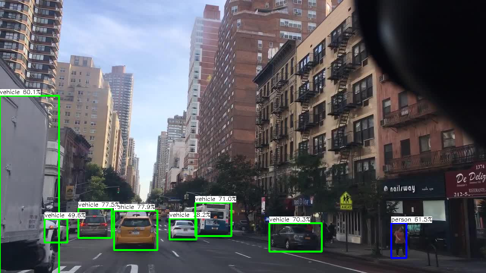

# Speed-up-network-inference-using-Ncnn
This packpage include some network inference speeding up examples using [NCNN](https://github.com/Tencent/ncnn).

## Requirement
Please install Ncnn first.
```
Ncnn VS2017 CPU(64bit)
```

## Road object detection
Including a tiny model (about 50MFLOPs) to detect the vehicle and person.

## How to use
The model dir includes some light-wight detection model in BDD100k, all of which includes a float32 model and a quantized model (int8), the corresonding metrics could be found in metrics.txt including the COCO AP metics and FLOPs. 
First, choosing the model you want to test. Then, check the test pictures dir, model dir in my_obj_det.cpp (line 282 205 206). Finally, complie whole project and run it. 

<div align=center></div>
