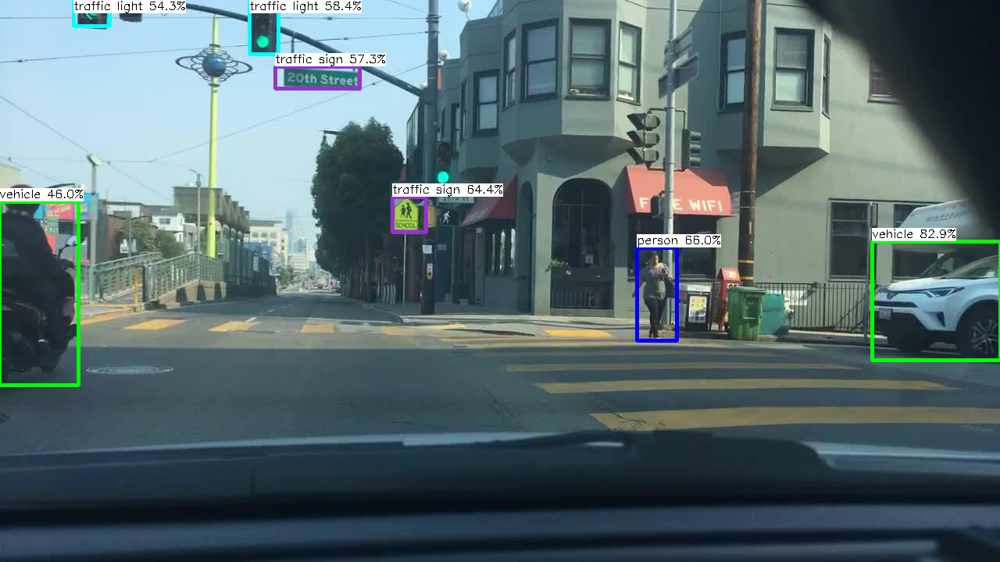

# Speed-up-network-inference-using-Ncnn
This packpage include some network inference speeding up examples using [NCNN](https://github.com/Tencent/ncnn).

## Requirement
Please install Ncnn first.
```
Ncnn VS2017 CPU(64bit)
```

## Road object detection
Including some light-wight detection model in BDD100k, only supports vehicle, person, traffic light and traffic sign.

## How to use
The models could be found in model dir, all of which includes a float32 model and a quantized model (int8), the corresonding metrics could be found in metrics.txt including the the metrics of COCO dataset and FLOPs. 
First, choosing the model you want to test. Then, check the test pictures dir, model dir in my_obj_det.cpp (line 282 205 206). Finally, complie whole project and run it. 

<div align=center></div> 

## Results 
| Method | Float32 Model |       | Int8 Model   |      |
|--------|---------------|-------|--------------|------|
|        | Speed \(ms\)  | AP50  | Speed \(ms\) | AP50 |
| v1     | 45\.6         | 38\.6 | 69\.4        | \-   |
| v2     | \-            | \-    | \-           | \-   |
| v3     | 289\.6        | 46\.2 | 233\.4       | \-   |
It seems that quantitative acceleration is not good
## Note
The models were based on Yolov2 with backbone mobilenetv2, trained by some freebies (e.g. warm up, focal loss, diou and etc.) and we remove many small objects in bdd100k to train the whole models.
